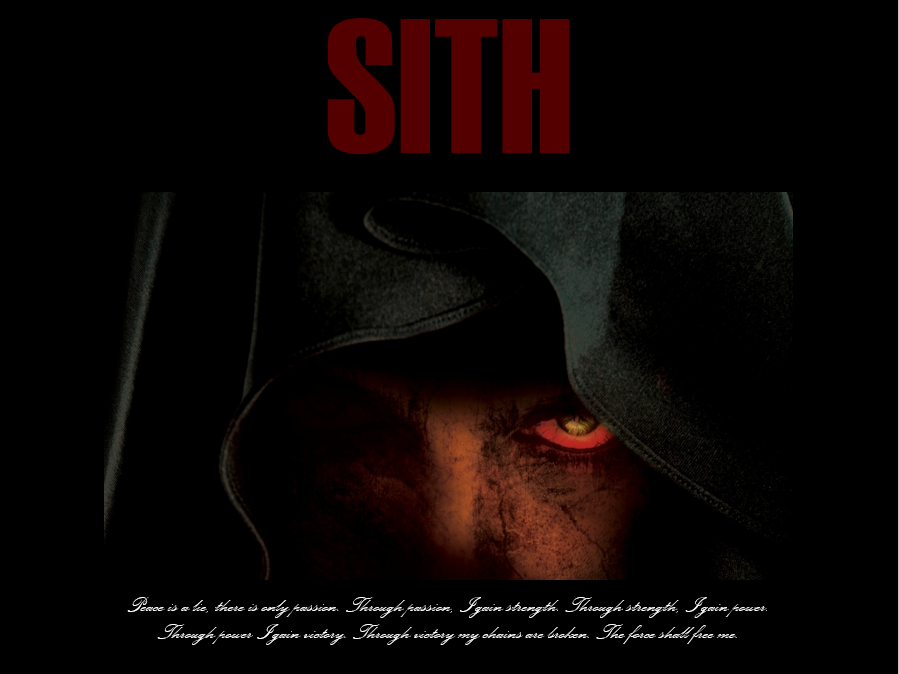

# Eyes of Sith



### About

_Eyes of Sith_ is a text based adventure game written in Common Lisp where the player can roam Korriban as an 'Old Republic Era' Sith and play as evil or friendly as your heart desires. 

Your master, Darth Imperius, has tasked you with killing Darth Nox. You must collect the right items to defeat him, or perish trying.


### Usage
Clone this repository.
```
> git clone https://github.com/glennga/eyes-of-sith
```
Open your favorite Common Lisp REPL and enter the following.

```commonlisp
(load "%LOCATION_OF_REPO%/main.lisp")
```

### Gameplay
If you have ever played a Bioware game, then think of this as a watered down version of that. You interact with characters (referred to as NPCs here) in the game and choose decisions based on this. Every decision you make changes your current story. 

You begin in the Dark Council's Chambers, where the NPC (and your master in this case) Darth Imperius stands. To describe your current location, the present NPCs, and the pathways you can travel, enter:

```
look

--------------------------------------------------------------------------
You see an empty row of decorated thrones. All of the lords are currently
in a meeting.
--------------------------------------------------------------------------
You are now in the Dark Councils Chambers on Korriban. There is a door going
 right from here. There is a stairway going downstairs from here.
 Darth Imperius is nearby.
```

To interact with Darth Imperius, enter the command below. Notice how spaces in this game are replaced with hyphens '-':

```
select darth-imperius

Darth Imperius is now the selected NPC.
```

To talk with Darth Imperius, simply enter the command below after selecting him:

```
talk

Have you killed him yet?
--------------------------------------------------------------------------
(A): Yes, I have killed him.
(B): I did not kill him yet.
--------------------------------------------------------------------------
```

Upon doing so, you are given several actions within the block. To perform action B, enter:

```
b
--------------------------------------------------------------------------
Then you know what to do. Do not return to me until your task is done.
--------------------------------------------------------------------------
```

You are not restricted to the Dark Council's Chambers! We are going to travel downstairs from here to get to the Sith Temple. _If you forget which ways you can walk, simply enter `look` again._

```
walk downstairs
--------------------------------------------------------------------------
The room is chilling despite there being a large amount of people around.
This place is bustling with individuals all from all over: Imperial
officers, soldiers, bounty hunters, and of course, Sith.
--------------------------------------------------------------------------
You are now in the Sith Temple on Korriban. There is a door going right from
 here. There is a door going left from here. There is a stairway going upstairs
 from here. There is a door going west from here. Dark Temple Guard 2 is
 nearby. Dark Temple Guard 1 is nearby. Apprentice Harken is nearby.
 Acolyte 2 is nearby. Acolyte 1 is nearby.
```

Upon interacting with characters in a certain way, your inventory gets affected. Enter the command below to view what you currently have.

```
inv
Items- (Your Saber) 
```

If you want to reset the game, enter:

```
reload
Your game has been reset.
```

For a review of these commands, enter:

```
The following commands are accepted =
(LOOK WALK INV HELP QUIT RELOAD SELECT TALK A B C)
```

### Hints

The game is best enjoyed when you don't know what to expect! But if you are impatient, I recommend fighting the Force Ghost with the Kolto Pack. The rest should be fairly straightforward if you play through it all. 